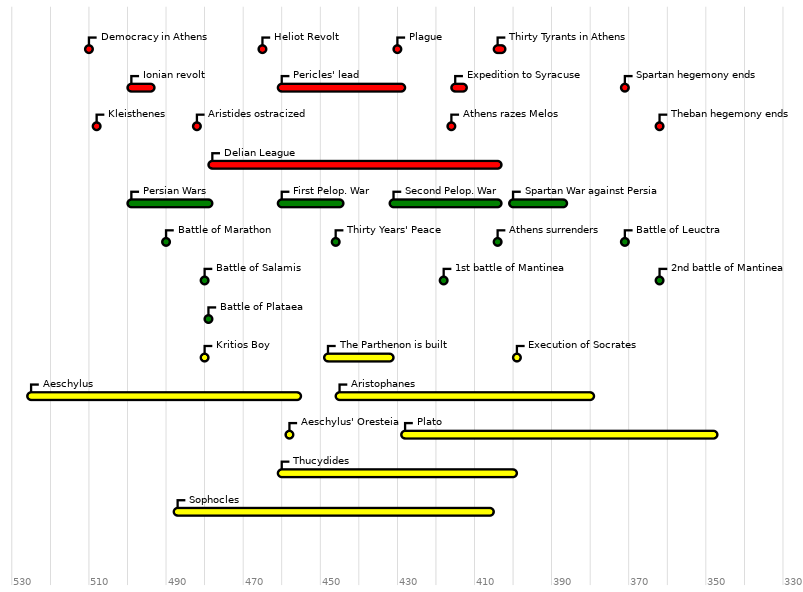
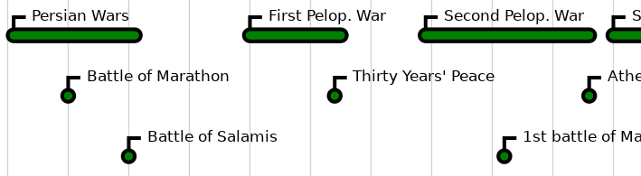
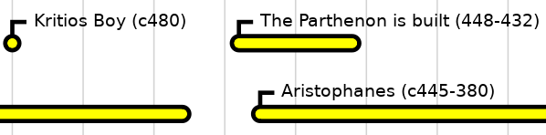

# mktimeline - timeline images from text data

This script converts a list of dates from a text format like this (all
dates are “BC”):

```
all_dates_bc = 1
525-456;  1: Aeschylus
458    ;  2: Aeschylus' Oresteia
445-380;  1: Aristophanes
399    ;  2: Execution of Socrates
428-348;  3: Plato
```

to an SVG image like this one:



An SVG image is a vector image, that means that you can zoom in without loosing any quality:




## Getting started

The data used to build the image are divided into:

- a timeline file (`.tl`) which contains:
   - a list of date files,
   - parameters specific to each data file,
   - parameters for the whole svg graphic;
- one or more date files (`.events`) which contain dates and event names.

Here is an example of a timeline file (for Ancient Greek history):

```
# list of date files (path and color)
greek-politics.events : red
greek-wars.events : green
greek-culture.events : yellow

# options for the whole grahics:
first_year = -550
last_year = -330
year_ratio = 10
year_caption_ratio = 20
print_dates = 0
year_interval = 5
```

Here is an example of a date file:

```
# option
all_dates_bc = 1

# literature
c 525-  456;  2: Aeschylus
  458      ;  3: Aeschylus' Oresteia
c 445-  380;  2: Aristophanes
c 460-c 400;  4: Thucydides
c 487-c 406;  5: Sophocles

# philosophy
  399      ;  1: Execution of Socrates
c 428-c 348;  3: Plato

# other
c 480      ;  1: Kritios Boy
  448-  432;  1: The Parthenon is built
```

You see that all the dates are “BC” (_before Christ_, or _before common era_) since the option `all_dates_bc` is set to `1`.

The first column indicates the date or the range of dates of the event.  The digit after the semi-colon indicates the row on which the event must be drawn.  The text of the colon is the name of the event.

If you choose to set `print_dates` to `1` in the global options, the dates are printed after the event name:



To get the image, run the command:

```
perl mktimeline.pl -o=OUTPUT_IMAGE.svg TIMELINE_FILE.tl
```

For example, to get the example below, run:

```
perl mktimeline.pl -o=testing/greek-history.svg testing/greek.tl
```

Use the `-h` switch to print help.


## Details

In each type of file white lines are ignored, and comments are preceded by the character `#`.


### The timeline file

The timeline file (`.tl`) contains: (1) events files (.events), their color and title; (2) global options for the entire timeline.

Events files and their specifications must be on one line each:

```
file_name : default_color [ : file_title ]
```

The file name is relative to the current directory; color must be a CSS compatible named color; the title is a title that go through the entire timeline and is used to label the events of the file (this is not working at the moment).

Global options are specified, one per line, with the format:

```
optioname = value
```

Examples of these options are:

```
first_year = -550
last_year = -330
year_ratio = 10
year_caption_ratio = 20
print_dates = 0
year_interval = 5
```


### The date file

The date file (`.events`) contains a serie of events to be included in the timeline. Remember that a timeline may be created from several date files, and so that a date file can be used for several timelines.

The only option such a file may have specifies if all dates must be understood before Christ, unless otherwise stated:

```
# default:
all_dates_bc = 0
# or:
all_dates_bc = 1
```

A date is given by the following format:

```
[c] year[BC|AD]
```

For example: `c 525BC`, or `800AD` (which is the same as `800`, unless `all_dates_bc` is set to `1`).

If `BC` or `AD` is not given, `AD` is used by default unless the `all_dates_bc` is specified before the date is read.  The `c` is used to indicate that the date is an approximate date, it is just used in the caption of the event (if `print_dates` is set to `1`).

For a range, you just add an end date separated from the start date by a hyphen: `c 525BC - 456`. If no end date is given, the event is a one-shot event and will be represented by a circle. Otherwise, it will be represented by a rectangle.

An event may be specified on two lines:

```
start_date [ - end_date ]
description
```

## Author

Please see my other works at [boberle.com](http://boberle.com), where you can also contact me, and at [github.com/boberle](https://github.com/boberle).

(c) 2013-2020 Bruno Oberle

Mozilla Public Licence, v2.0.  See the `LICENSE` file.
